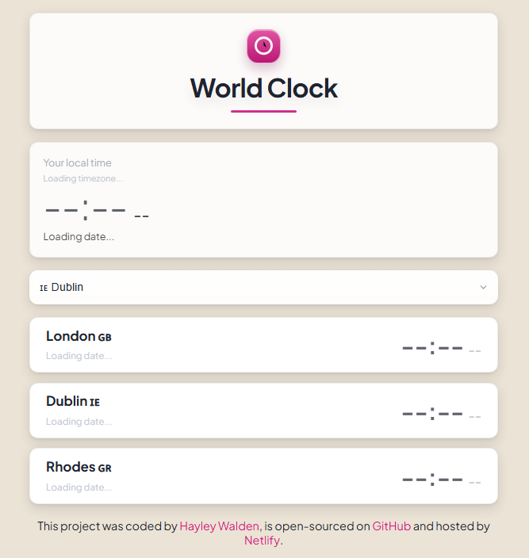

# World Clock

A simple World Clock web app built as part of the **SheCodes Plus Add-On** course. Select a city and see the current time/date for multiple locations, with a clean, card-based UI and keyboard-friendly focus states.

## Live demo

- Netlify: https://dev-world-clock-73.netlify.app

## Screenshot

## Features

- City picker (native `<select>`)
- Local time “hero” card + world city cards
- Hover + `:focus-visible` polish (no layout-jump)
- Responsive layout (tuned for small screens)

## Built with

- HTML
- CSS (Flexbox, media queries)
- JavaScript (in progress / next step)
- Moment.js + Moment Timezone (if/when added in the JS step)

## Accessibility notes

- Keyboard focus styles use `:focus-visible` (pink ring)
- Visually hidden labels use a `.visually-hidden` utility class
- Links have a visible focus state and hover affordance

## Project structure

world-clock/
├─ index.html
└─ src/
├─ styles.css
└─ index.js
└─ images/
└─ world-clock.png

## Run locally

### Option A: simplest

1. Open `index.html` in your browser.

### Option B: recommended (VS Code)

1. Install the **Live Server** extension.
2. Right-click `index.html` → **Open with Live Server**.

## Roadmap (next)

- Hook up city selection in JS and update the selected city display
- Add “selected city” styling (pink accent) via a class toggled in JS
- (Optional) Add `aria-live="polite"` to dynamic time/date containers

## Credits

Coded by **Hayley Walden**. Hosted on Netlify.

## License

This project is for learning/portfolio use.
