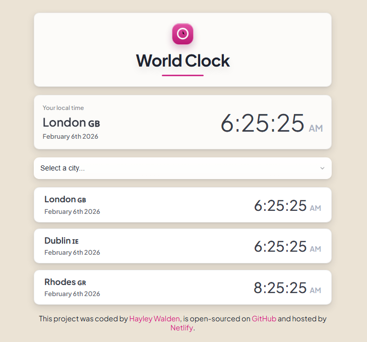
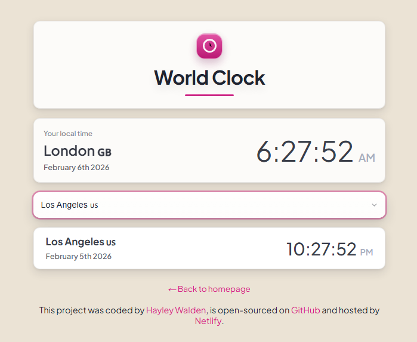

# World Clock

A simple World Clock web app built as part of the **SheCodes Plus Add-On** course. Select a city and see the current time/date for multiple locations, with a clean, card-based UI and keyboard-friendly focus states.

## Live demo

- Netlify: https://world-clock-73.netlify.app/

## Source code

- GitHub: https://github.com/chasemystatus/world-clock

## Screenshots

Default view:



Selected city view:



## Features

- City picker (native `<select>`)
- Local time “hero” card + world city cards
- Hover + `:focus-visible` polish (no layout-jump)
- Responsive layout (tuned for small screens)

## Built with

- HTML
- CSS (Flexbox, media queries)
- JavaScript
- Moment.js
- Moment Timezone

## Accessibility notes

- Keyboard focus styles use `:focus-visible` (pink ring)
- Visually hidden labels use a `.visually-hidden` utility class
- Links have a visible focus state and hover affordance

## Project structure

```text
world-clock/
├─ index.html
├─ README.md
├─ images/
│  ├─ world-clock-default.png
│  └─ world-clock-selected.png
└─ src/
   ├─ styles.css
   └─ index.js
```

## Run locally

### Option A: simplest

1. Open `index.html` in your browser.

### Option B: recommended (VS Code)

1. Install the **Live Server** extension.
2. Right-click `index.html` → **Open with Live Server**.

## Credits

Coded by **Hayley Walden**. Hosted on Netlify.

## License

This project is for learning/portfolio use.
